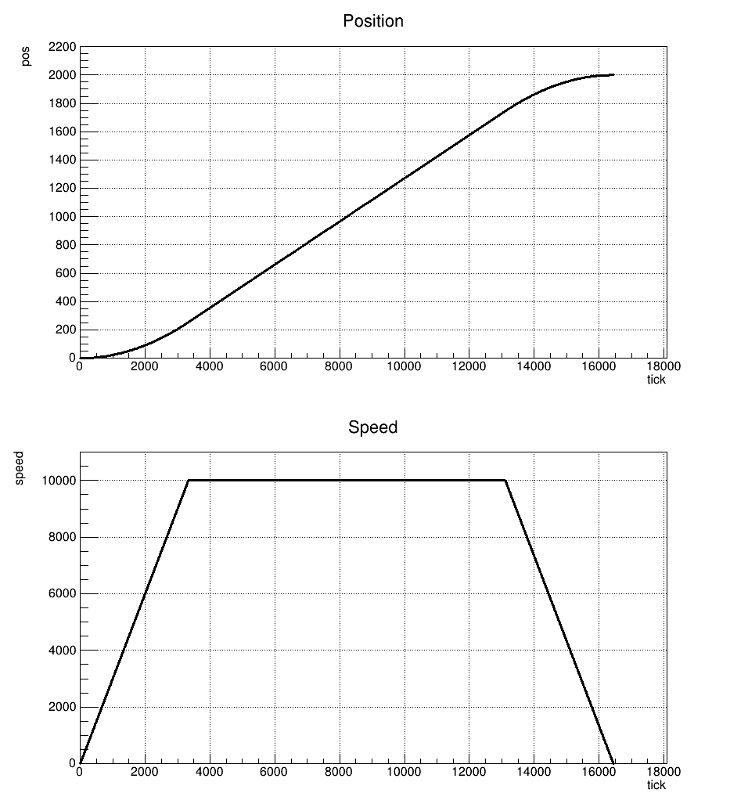

# A trapezoid speed profile via the _Step per Time Algorithm_

:warning: _DISCLAIMER. It is not completely ready yet. There might be some inaccuracies and unexpected results._ :warning:

## Acknowledgements

The idea is based on this [article](https://picprog.strongedge.net/step_prof/step-profile.html) . I wasn't able to open the link with the code
mentioned there, so the implementation can be very different (for example, I am not using fixed point numbers at all).

## Example

This is how it is look like.

The code of this example is available [here](examples/ROOT/).
You need to have the [ROOT framework](https://root.cern/about/) installed to run this example.

## TODO

- [ ] Handle edge cases properly (one step required, max speed ~ acceleration, acceleration and/or max speed = 0, etc)
- [ ] Add tests
- [ ] Add `keywords.txt`
- [ ] Add docs
